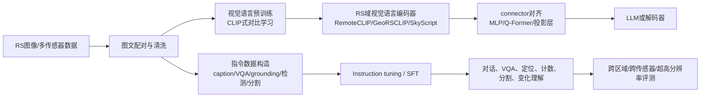

# VLM 与遥感 VLM 大规模检索及快速理解路线

检索日期：2026-09-10

## 0. 先给结论

“VLM”在遥感文献里通常混合指两类模型，不能把它们当成同一种东西：

1. **CLIP 型视觉语言基础模型**：图像编码器和文本编码器被训练到同一个特征空间，擅长零样本分类、图文检索、开放词汇识别和语义定位，但本身通常不会像 ChatGPT 一样自由对话。
2. **MLLM/LVLM 型生成模型**：视觉编码器提取视觉 token，经 projector、Q-Former 或其他 connector 映射到 LLM 的语言空间，再生成回答、描述、坐标、掩膜或结构化结果。

遥感领域的主流程可以压缩成：



最值得先理解的不是模型名字，而是四个问题：

- 图像和文本是怎样配对的？是真实文本、人工标注，还是模型生成 caption？
- 训练目标是对比学习、图像描述生成，还是语言模型的 next-token prediction？
- 视觉特征如何进入语言模型？是全局 embedding、patch token、Q-Former，还是高分辨率 tile/token 选择？
- RS 的提升来自真正的视觉域适配，还是主要来自更好的提示词、数据混合、分辨率和评测设置？

## 1. 先读的综述

建议先读两篇，再用第三篇补充最新数据集；不要一开始就从几十篇模型论文逐篇啃。

| 优先级 | 论文 | 作用 |
|---|---|---|
| S | [Vision-Language Models in Remote Sensing: Current progress and future trends](https://arxiv.org/abs/2305.05726) | 2024 年较完整的 RS-VLM 总览，覆盖 caption、检索、VQA、分类、分割、检测等任务。 |
| S | [Vision-Language Modeling Meets Remote Sensing: Models, Datasets and Perspectives](https://arxiv.org/abs/2505.14361) | 2025 年更新版，按 contrastive learning、visual instruction tuning、text-conditioned generation 分类，适合建立完整地图。 |
| A | [Advancements in Vision–Language Models for Remote Sensing](https://doi.org/10.3390/rs17010162) | 更偏教程和数据集综述，可用来查数据规模、任务和增强策略。 |
| A | [A Survey on Remote Sensing Foundation Models: From Vision to Multimodality](https://arxiv.org/abs/2503.22081) | 将 VLM 放入 RS foundation model 大背景，适合区分视觉基础模型、多模态基础模型和 VLM。 |

## 2. 通用 VLM 主干：按这条路线读

### 2.1 第一层：为什么图像可以被语言“调用”

| 优先级 | 论文 | 重点看什么 |
|---|---|---|
| S | [CLIP: Learning Transferable Visual Models From Natural Language Supervision](https://arxiv.org/abs/2103.00020) | image encoder、text encoder、batch 内对比学习、zero-shot prompt；这是 RemoteCLIP/GeoRSCLIP 的概念源头。 |
| A | [Sigmoid Loss for Language Image Pre-Training](https://arxiv.org/abs/2303.15343) | 了解 SigLIP 与 CLIP softmax 对比损失的差别，以及大规模训练时 batch 和负样本的影响。 |
| A | [BLIP: Bootstrapping Language-Image Pre-training](https://arxiv.org/abs/2201.12086) | 理解 caption 生成与过滤如何清洗噪声图文对，并同时支持理解和生成。 |

CLIP 的核心可以写成：图像编码器得到 $v_i$，文本编码器得到 $t_i$，通过温度系数和余弦相似度，让正确图文对相近、错误配对相远。推理时，把类别名称写成文本 prompt，再比较图像与多个类别文本的相似度。因此 CLIP 更像一个“语言可调用的视觉特征/匹配器”，不是完整对话模型。

### 2.2 第二层：怎样让 LLM 读懂视觉 token

| 优先级 | 论文 | 重点看什么 |
|---|---|---|
| S | [Flamingo: a Visual Language Model for Few-Shot Learning](https://arxiv.org/abs/2204.14198) | 视觉和语言模型如何桥接、如何处理图文交错输入、为什么可以 few-shot。 |
| S | [BLIP-2: Bootstrapping Language-Image Pre-training with Frozen Image Encoders and Large Language Models](https://arxiv.org/abs/2301.12597) | Q-Former 的作用；冻结视觉编码器和 LLM，只训练中间桥接模块的思想。 |
| S | [Visual Instruction Tuning / LLaVA](https://arxiv.org/abs/2304.08485) | 视觉编码器 + projector + LLM 的简洁架构，以及两阶段训练。 |
| S | [InstructBLIP](https://arxiv.org/abs/2305.06500) | instruction-aware Q-Former；不同任务怎样被统一改写成指令数据。 |
| A | [Improved Baselines with Visual Instruction Tuning / LLaVA-1.5](https://arxiv.org/abs/2310.03744) | 更高分辨率 CLIP、MLP projector、学术 VQA 数据混合；这是很多 RS MLLM 的直接基线。 |

通用生成式 VLM 的典型训练路径是：

1. 已有的视觉编码器先把图像变成 patch-level visual tokens。
2. connector 把视觉 token 的维度和分布映射到 LLM 能接受的语言 embedding 空间。
3. 在图文对或 image-caption 数据上做多模态预训练/feature alignment。
4. 将 caption、VQA、定位、推理等任务转成 instruction-response 格式，做 visual instruction tuning。
5. 推理时，图像 token 和文本指令一起进入 LLM，LLM 生成答案或结构化字符串。

这里要特别避免一个常见误解：**视觉编码器越强，不等于对话能力越强；LLM 越大，也不等于空间定位越准。** 视觉表征、跨模态对齐、指令数据和输出格式是四个相互耦合但不等价的因素。

## 3. RS 视觉语言基础模型：先理解“域适配”

### 3.1 图文对比学习与 RS encoder

| 优先级 | 论文 | RS 贡献与阅读重点 |
|---|---|---|
| S | [RemoteCLIP: A Vision Language Foundation Model for Remote Sensing](https://arxiv.org/abs/2306.11029) | 用 Box-to-Caption、Mask-to-Box 等方式把原本只有类别/框/掩膜标签的数据统一变成 image-caption；重点看数据扩展、16 个下游数据集和 zero-shot/检索/计数。 |
| S | [RS5M and GeoRSCLIP](https://arxiv.org/abs/2306.11300) | 约 500 万 RS 图文对；重点看数据过滤、伪 caption、CLIP 微调和 DVLM 如何桥接通用 CLIP 与 RS 下游任务。 |
| S | [SkyScript: A Large and Semantically Diverse Vision-Language Dataset for Remote Sensing](https://arxiv.org/abs/2312.12856) | 利用地理坐标连接 RS 图像与 OpenStreetMap 语义，构造约 260 万图文对、2.9 万语义标签；重点看地理先验如何补足互联网图文数据稀缺。 |
| A | [LRSCLIP: A Vision-Language Foundation Model for Aligning Remote Sensing Image with Longer Text](https://arxiv.org/abs/2503.19311) | 从短 caption 走向长文本和细粒度语义对齐；重点看长文本编码、双文本损失和 hallucination 问题。 |
| A | [SatCLIP: Global, General-Purpose Location Embeddings with Satellite Imagery](https://arxiv.org/abs/2311.17179) | 它不是标准的 image-text chat VLM，而是 image-location 对比学习；适合理解 RS 中“地理位置语义”这一额外模态。 |
| A | [SkySense: A Multi-Modal Remote Sensing Foundation Model](https://openaccess.thecvf.com/content/CVPR2024/html/Guo_SkySense_A_Multi-Modal_Remote_Sensing_Foundation_Model_Towards_Universal_Interpretation_CVPR_2024_paper.html) | 不是语言中心的 VLM，但展示了多模态、时序和地理上下文的 RS foundation model 路线，适合和 RemoteCLIP 对比。 |

这组论文回答的是：**为什么直接拿自然图像 CLIP 到 RS 上会掉性能，以及应该改数据、改视觉编码器，还是加入地理/传感器先验。**

### 3.2 RS 指令微调与对话式 MLLM

| 优先级 | 论文 | 重点看什么 |
|---|---|---|
| S | [RSGPT: A Remote Sensing Vision Language Model and Benchmark](https://arxiv.org/abs/2307.15266) | 早期 RS caption/VQA 路线；RSICap 只有约 2,585 条人工高质量 caption，但强调描述丰富性，适合理解“小而精”监督。 |
| S | [GeoChat: Grounded Large Vision-Language Model for Remote Sensing](https://openaccess.thecvf.com/content/CVPR2024/html/Kuckreja_GeoChat_Grounded_Large_Vision-Language_Model_for_Remote_Sensing_CVPR_2024_paper.html) | 以 LLaVA-1.5 为骨架，增加 region input、坐标输出和 grounded conversation；重点看高分辨率、区域级 reasoning、318k 指令数据和 LoRA。 |
| A | [SkyEyeGPT: Unifying Remote Sensing Vision-Language Tasks via Instruction Tuning](https://arxiv.org/abs/2401.09712) | 约 968k RS 指令样本，统一图像级和区域级任务；适合和 GeoChat 比较数据规模与任务统一方式。 |
| A | [EarthGPT: A Universal MLLM for Multi-sensor Image Comprehension](https://arxiv.org/abs/2401.16822) | MMRS-1M，覆盖 optical、SAR、infrared 等多传感器；重点看跨传感器统一指令 tuning，而不是只看 optical VQA。 |
| A | [LHRS-Bot: Empowering Remote Sensing with VGI-Enhanced MLLM](https://arxiv.org/abs/2402.02544) | 用 volunteered geographic information 构造 LHRS-Align 和 LHRS-Instruct，并引入多层视觉语言对齐与 curriculum learning。 |
| A | [Falcon: A Remote Sensing Vision-Language Foundation Model](https://arxiv.org/abs/2503.11070) | 0.7B 模型、约 7,800 万 instruction samples、14 类任务；适合观察“小模型 + 大量结构化多任务数据”的路线。 |
| A | [GeoRSMLLM](https://arxiv.org/abs/2503.12490) | 2025 年 geoscience/RS 多模态大模型路线，适合放到 Falcon、EarthGPT、GeoChat 之后比较。 |

RS MLLM 的典型域适配方式不是从头训练一个全新 LLM，而是：

```text
通用视觉编码器/CLIP + 通用 LLM
        ↓
RS 图像与标签/地理信息生成 caption、VQA、region description、坐标输出
        ↓
多模态 instruction tuning 或 LoRA
        ↓
RS 对话、VQA、caption、grounding、计数、分类、检测/分割接口
```

其中 GeoChat 的关键不是“用了一个更大的 LLM”，而是把 RS 的区域框、旋转框、区域描述和任务 token 加入输入/输出协议。它对你的开放词汇分割研究的启发是：语言对齐可以提供类别语义，但高质量像素级边界仍需要专门的 dense visual branch 或 segmentation decoder。

## 4. RS 中最需要单独理解的三个难点

### 4.1 超高分辨率

| 论文 | 作用 |
|---|---|
| [GeoLLaVA-8K](https://arxiv.org/abs/2505.21375) | 面向 8K RS 图像，研究 background token pruning 和 anchored token selection；说明普通 336/448 输入会丢掉小目标和局部关系。 |
| [Coarse-to-Fine Text-Guided Token Pruning](https://arxiv.org/abs/2503.07588) | 用文本引导区域聚焦和动态图像金字塔，构造最多约 27,328 像素的 LRS-VQA。 |
| [XLRS-Bench](https://openaccess.thecvf.com/content/CVPR2025/html/Wang_XLRS-Bench_Could_Your_Multimodal_LLMs_Understand_Extremely_Large_Ultra-High-Resolution_Remote_CVPR2025_paper.html) | 平均图像约 8500×8500，16 个子任务；用于检验模型是否真的理解超高分辨率，而不是只会看缩略图。 |

### 4.2 空间、时间和非光学传感器

普通 VLM 常常会“说得像懂了”，但在小目标计数、旋转目标、跨时相变化、SAR/红外语义上失败。因此要关注：

- EarthGPT：多传感器统一理解；
- SatCLIP：图像与地理位置对齐；
- GEOBench-VLM：场景、分类、计数、定位、分割、事件和时间理解；
- XLRS-Bench：大图、复杂关系和空间推理。

### 4.3 语言输出不等于视觉 grounding

caption/VQA 指标较高不表示目标框或像素 mask 准确。至少要分别评估：

- image-level：场景分类、caption、VQA；
- region-level：区域 caption、referring expression、object grounding；
- pixel-level：semantic/instance segmentation、开放词汇分割；
- temporal/multi-sensor：变化检测、SAR/optical 对齐和多时相解释。

这也是为什么你现在的 RSKT-Seg、LaRSE、RemoteCLIP、RS-DINO、RS-CMA、RS-Fusion、RS-Transfer 应当被放在“语言对齐视觉特征如何进入 dense prediction”的分支，而不是简单称为一个聊天型 RS-VLM。

## 5. 评测论文：判断模型是真懂还是会生成

| 优先级 | 论文/基准 | 主要检查能力 |
|---|---|---|
| S | [GeoChat-Bench](https://mbzuai-oryx.github.io/GeoChat/) | 图像/区域 caption、VQA、场景分类、grounded conversation、referring detection。 |
| A | [COREval](https://arxiv.org/abs/2411.18145) 或其更新命名 [CHOICE](https://rs-choice.github.io/) | 按 perception/reasoning 分层评估多个 RS 能力。 |
| S | [GEOBench-VLM](https://openaccess.thecvf.com/content/ICCV2025/html/Danish_GEOBench-VLM_Benchmarking_Vision-Language_Models_for_Geospatial_Tasks_ICCV2025_paper.html) | 31 个细粒度任务、8 大类别，含非光学和时间任务；适合看通用 VLM 与 RS 模型的真实差距。 |
| S | [XLRS-Bench](https://xlrs-bench.github.io/home_page.html) | 超高分辨率、10 个二级任务、16 个子任务、约 1,400 张图像和 45,942 条标注。 |
| A | [VLRS-Bench](https://github.com/MiliLab/VLRS-Bench) | 更偏地理场景 reasoning，不只检查“图里有什么”，还检查不确定性、时空关系和决策推理。 |
| A | [RSMMVP / A Vision Centric Remote Sensing Benchmark](https://arxiv.org/abs/2503.15816) | 针对 CLIP/MLLM 的视觉中心能力和 grounding 弱点。 |

阅读这些 benchmark 时，不要只抄 overall score。应记录：图像分辨率、是否多时相、是否使用外部知识、答案是否多选、是否人工核验、是否存在文本 shortcut，以及是否真正要求模型读图。

## 6. 给你的最短精读顺序

### 目标 A：快速理解 VLM 基础机制

1. CLIP
2. BLIP-2
3. LLaVA
4. LLaVA-1.5
5. InstructBLIP

读完这 5 篇，应该能回答：视觉 token 从哪里来、connector 在做什么、为什么要两阶段训练、为什么 instruction tuning 会改变模型行为、CLIP 与聊天型 MLLM 的输出机制有什么不同。

### 目标 B：快速进入 RS-VLM

1. RS-VLM 2024 综述
2. RemoteCLIP
3. RS5M/GeoRSCLIP
4. SkyScript
5. GeoChat
6. EarthGPT
7. GEOBench-VLM 或 XLRS-Bench

读完这 7 篇，应该能把 RS 论文放入四层：数据构造、视觉语言预训练、指令微调、评测与部署。

### 目标 C：连接到你的开放词汇分割/建筑功能研究

1. CLIP：理解文本类别原型和 zero-shot 分类。
2. RemoteCLIP + GeoRSCLIP：理解 RS 域图文特征为什么可能优于普通 CLIP。
3. GeoChat：理解 image-level/region-level/grounded output 的差别。
4. LLaVA-1.5：理解 projector 与语言空间对齐。
5. 你的 RSKT-Seg/LaRSE 笔记：检查 RemoteCLIP/RS-DINO 到 dense logits、边界恢复和建筑功能类别预测的真实代码路径。

最合理的研究表述是：**将 RS 视觉语言表征或语言类别语义引入 dense prediction/开放词汇分割前端**；不要把普通 CLIP、RemoteCLIP、GeoChat 和 RSKT-Seg 统称成同一种“VLM”。

## 7. 精读每篇论文时统一填写的证据表

```text
论文：
模型类型：CLIP式编码器 / BLIP式理解生成 / LLaVA式MLLM / dense或grounded模型
数据来源：真实人工文本 / OSM或地理信息 / 规则生成 / VLM或LLM生成 / 混合
视觉输入：普通patch / 高分辨率tile / 多时相 / optical-SAR-IR / region prompt
跨模态桥接：共享embedding / Q-Former / MLP projector / cross-attention / token pruning
训练阶段：预训练、对齐、SFT、LoRA、下游任务微调
输出：相似度、类别、caption、VQA、框、坐标、mask或多任务文本
关键实验：哪些数据集、哪些 baseline、是否公平、是否有消融
真正证据：方法/实验/附录/代码中的具体位置
主要局限：数据噪声、空间尺度、传感器、语言幻觉、评测 shortcut、泛化范围
对我项目的启发：
```

## 8. 当前最值得追踪的研究问题

- 如何构造既大又可靠的 RS image-text pairs，减少伪 caption 和地理标签偏差？
- 如何让模型同时理解全局场景、小目标、旋转目标和像素边界？
- 多模态 RS foundation model 如何在 optical、SAR、红外、LiDAR、时间序列之间共享语义？
- 如何证明模型使用了图像，而不是依靠类别先验或问题文本 shortcut？
- 如何把 image-text embedding 的开放词汇能力稳定地传给 segmentation/detection decoder？
- 如何评价跨区域、跨传感器、跨分辨率和跨时相泛化，而不是只在同分布 benchmark 上比较？

## 9. 检索边界与可信度说明

本清单优先收录 arXiv、CVPR/ICCV/NeurIPS 等论文页、作者项目页和官方代码仓库。2025—2026 年的部分工作仍可能是预印本或刚发表论文，阅读时应单独核对最终版本、代码和数据是否真正公开。模型论文中的“first”“state of the art”“foundation model”等表述不能直接当作事实，应回到数据规模、训练阶段、对照设置和 benchmark 协议核实。
